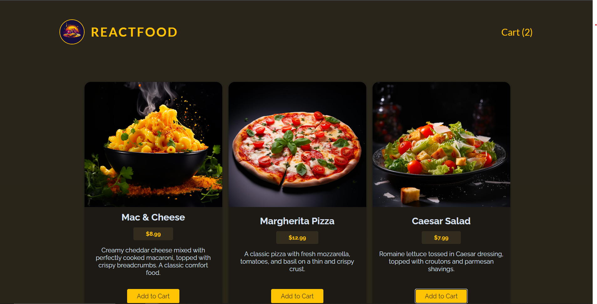
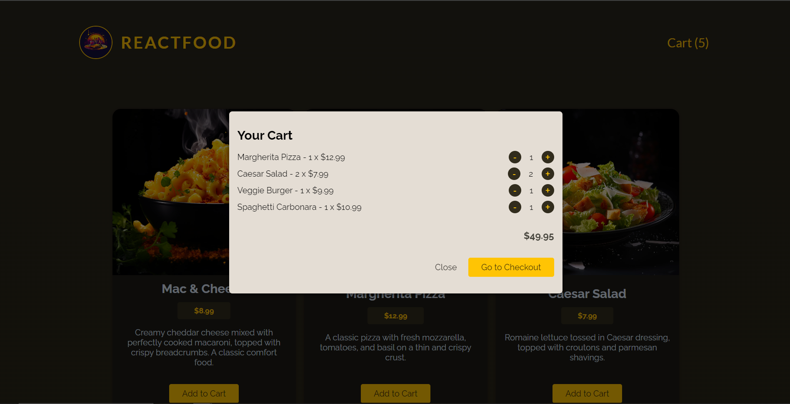
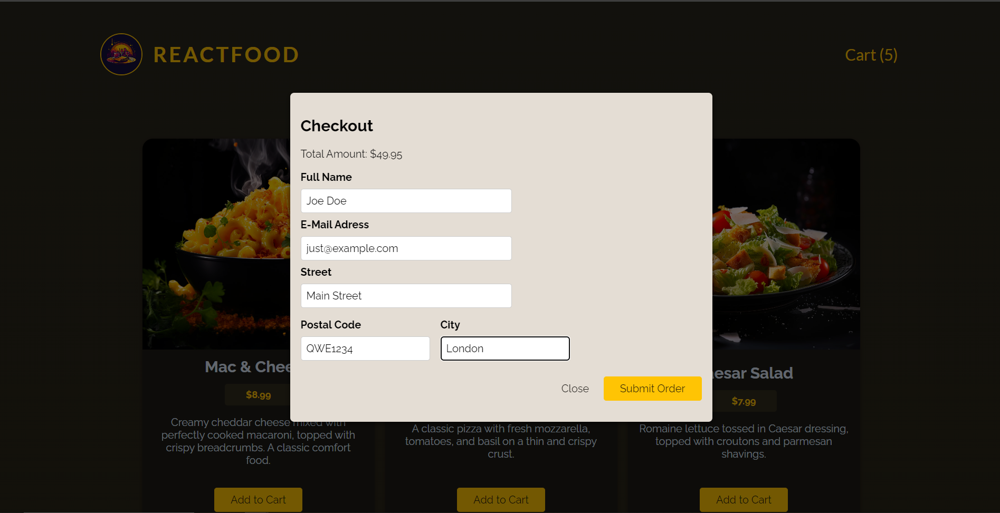
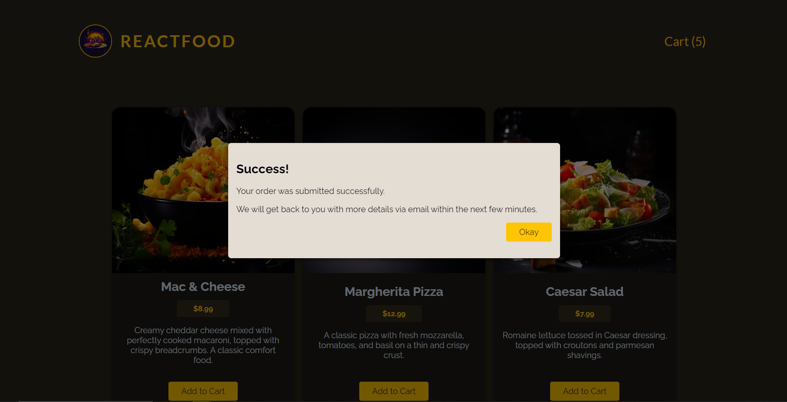

### Food Order Project

It demonstrates the development of a food ordering application using React and Node.js. Below you will find detailed instructions and information about the project setup, structure, and functionality.

## Table of Contents

- [Project Description](#project-description)
- [Features](#features)
- [Screenshots](#screenshots)
- [Technologies Used](#technologies-used)
- [Installation](#installation)
- [Usage](#usage)
- [Project Structure](#project-structure)
- [API Endpoints](#api-endpoints)
- [Contributing](#contributing)

## Project Description

The Food Order project is a simple yet powerful application that allows users to browse a list of available meals, add them to a cart, and place orders. The project includes both front-end and back-end components, showcasing the integration between a React-based front-end and a Node.js/Express back-end.

## Features

- Browse available meals
- Add meals to the cart
- Adjust quantities of items in the cart
- Place an order with customer details
- View orders on the server

## Screenshots

Here are some screenshots of the application:

### Homepage



### Cart



### Checkout



### Success



## Technologies Used

- **Front-end:** React, Context API, Hooks
- **Back-end:** Node.js, Express
- **Database:** JSON files (for simplicity)
- **Styling:** CSS
- **Others:** fetch API, body-parser, cors

## Installation

Follow these steps to set up the project locally:

### Prerequisites

- Node.js installed (version 14 or higher recommended)
- npm (Node Package Manager)

### Clone the Repository

```bash
git clone https://github.com/Roman-Manzhelii/Food-Order.git
cd Food-Order
```

### Install Dependencies

Navigate to the project root directory and run:

```bash
npm install
```

### Set Up Back-end

Navigate to the back-end directory and install dependencies:

```bash
cd backend
npm install
```

## Usage

### Running the Back-end Server

In the `backend` directory, start the server:

```bash
npm start
```

The server will start on `http://localhost:3000`.

### Running the Front-end Application

Navigate back to the root directory and start the React application:

```bash
npm run dev
```

The application will be available on `http://localhost:5173`.

## Project Structure

Here is an overview of the project structure:

```
food-order/
├── backend/
│   ├── data/
│   │   ├── available-meals.json
│   │   ├── orders.json
│   ├── app.js
├── public/
├── src/
│   ├── components/
│   │   ├── Cart/
│   │   ├── Meals/
│   │   ├── UI/
│   ├── hooks/
│   ├── store/
│   ├── util/
│   ├── App.js
│   ├── index.js
│   ├── ...
├── package.json
├── README.md
```

## API Endpoints

### GET /meals

Retrieves a list of available meals.

- **URL:** `/meals`
- **Method:** `GET`
- **Response:** JSON array of meals

### POST /orders

Submits a new order.

- **URL:** `/orders`
- **Method:** `POST`
- **Headers:** `Content-Type: application/json`
- **Body:** JSON object containing order details
- **Response:** JSON message confirming order creation

## Contributing

Contributions are welcome! Please follow these steps:

1. Fork the repository
2. Create a new branch (`git checkout -b feature-branch`)
3. Make your changes
4. Commit your changes (`git commit -m 'Add some feature'`)
5. Push to the branch (`git push origin feature-branch`)
6. Open a pull request

